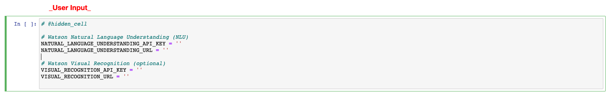

# PixieDustとコグニティブJupyterノートブックでFacebookからの洞察を発見する

*Read this in other languages: [English](README.md), [한국어](README-ko.md)*

> Data Science Experience は　現在は Watson Studio になりました。しかしながら、このコードバターン上のいくつかのイメージ はData Science Experienceのものがあります。修正作業を進めています。

このコードパターンでは、Jupyter ノートブックを使用して大量の非構造化データから洞察を引き出します。
[Anna Quincy](https://www.linkedin.com/in/anna-quincy-25042957) と [Tyler Andersen](https://www.linkedin.com/in/tyler-andersen-2bb82336) が初期の ノートブック 設計を提供してくれました。

 最初にFacebook Analytics のエクスポートからデータを取得し、そのデータを Watson Visual Recognition、Natural Language Understanding(NLU)、Tone Analyzer でエンリッチします。

エンリッチされたデータを使用して、次のような質問の答えを見つけます。

> エンゲージメントの実績が高い投稿全体にわたるセンチメントは何か
> 記事のテキストの社会的トーン、記事の主なエンティティー、エンゲージメントの実績の間にはどのような関係があるか

ブランド認知、製品の性能、顧客満足、オーディエンス・エンゲージメントを理解して向上させることに関心を持つマーケティング・アナリストにとって、このような洞察は価値があります。

注意すべき点として、このコード・パターンは特定の出力セットを使用するアプリケーションではなく、ガイド付き実験として利用されることを意図している点があります。Facebook Analytics の標準的なエクスポートには、投稿のテキスト、記事、サムネイルとともに、Facebook の標準的なパフォーマンス・メトリック (いいね、共有、およびインプレッションの数) が含まれます。この非構造化コンテンツからキーワード、エンティティー、センチメント、トーンを抽出するために、Watson API を使用してデータをエンリッチします。

Watson API でエンリッチされたデータを分析するには、さまざまな方法がありますが、Watson Studio では堅牢ながらも柔軟な手法で Facebook のコンテンツを探索することができます。

このコード・パターンには、Facebook のモック・データ (ノートブック) が用意されています。また、ビルド前の視覚化がいくつか付属しているので、隠れた洞察を発見するための作業をすぐに開始できます。

このコード・パターンをひと通り完了すると、以下の方法がわかるようになります:

* Watson Studio Object Storage と pandas DataFrame を介して外部データを Jupyter ノートブック に読み込む
* Jupyter ノートブック と 以下のWatson APIを利用して、非構造化データをエンリッチする
  * [Natural Language Understanding](https://www.ibm.com/watson/services/natural-language-understanding/)
  * [Tone Analyzer](https://www.ibm.com/watson/services/tone-analyzer/)
  * [Visual Recognition](https://www.ibm.com/watson/services/visual-recognition/)
* [PixieDust](https://github.com/pixiedust/pixiedust) を使用してデータを探索し、洞察を視覚化する


## Flow

1. Facebook Analytics からエクスポートされた CSV ファイルが Watson Studio Object Storage に追加されます。
2. 生成されたコードによって、ファイルが pandas DataFrame としてアクセス可能になります。
3. Watson Natural Language Understanding によってデータがエンリッチされます。
4. Watson Tone Analyzer によってデータがエンリッチされます。
5. Watson Visual Recognition によってデータがエンリッチされます。
6. エンリッチされたデータを PixieDust で探索して、隠れた洞察を明らかにし、それらの洞察を強調表示するグラフを作成できます。

## 使用しているコンポーネント

* [IBM Watson Studio](https://www.ibm.com/watson/jp-ja/developercloud/watson-studio.html): マネージされたSparkなどIBMの価値あるツールを含む統合されたコラボレーティブな環境でRStudio, Jupyter, Python 等でデータ分析が可能です。

* [IBM Cloud Object Storage](https://www.ibm.com/cloud-computing/jp-ja/products/storage/object-storage/): IBM Cloud サービス は高い信頼性と迅速な市場投入で費用対効果の高いアプリケーションとサービスを構築し提供する非構造化クラウドデータストアを提供しています。

* [Watson Natural Language Understanding](https://www.ibm.com/watson/services/natural-language-understanding/): 高度なテキスト分析のための自然言語処理

* [Watson Tone Analyzer](https://www.ibm.com/watson/services/tone-analyzer/): テキストから筆者の感情、社交性、文体を解析する

* [Visual Recognition](https://www.ibm.com/watson/services/visual-recognition/): 画像認識

## Featured technologies

* [Jupyter Notebooks](https://jupyter.org/): 
ライブコード、実行、ビジュアライゼーション、および説明テキストを含む文書を作成および共有できるようにするオープンソースのWebアプリケーション。


* [PixieDust](https://github.com/pixiedust/pixiedust): PixieDustは、データを扱う際のユーザーエクスペリエンスを向上させるために、Jupyterノートブックのアドオンとして機能するオープンソースのヘルパーライブラリです。

* [pandas](https://pandas.pydata.org/): 高性能で使いやすいデータ構造を提供するPythonライブラリ。

* [Beautiful Soup](https://www.crummy.com/software/BeautifulSoup/bs4/doc/): Beautiful SoupはHTMLとXMLファイルからデータを抽出するためのPythonライブラリです。

* [Data Science](https://developer.ibm.com/technologies/data-science/): 知識と洞察を引き出すために構造化データと非構造化データを分析するためのシステムと科学的方法。

* [Artificial Intelligence](https://developer.ibm.com/technologies/artificial-intelligence/): ワトソンは人間のように考えることができる認知技術です。
* [Analytics](https://developer.ibm.com/technologies/analytics/): Analyticsは、企業にデータの価値をもたらします。
* [Python](https://www.python.org/): Pythonは、あなたがより速く仕事をし、あなたのシステムをより効果的に統合することを可能にするプログラミング言語です。

## Watch the Video
日本語：
[](https://youtu.be/fPDMxhk2yDQ)

英語:
[](https://www.youtube.com/watch?v=UIkjFo9o3vI)

## Steps

下記の手順に従って、セットアップとこのコードパターンの実行をしてください。詳細はこの下にあります。


1. [Watson Studioにサインアップ](#1-watson-studioにサインアップ)
1. [プロジェクトとサービスの作成](#2-プロジェクトとサービスの作成)
1. [Watson Studioでノートブックの作成](#3-watson-studioでノートブックの作成)
1. [Credentialの追加](#4-credentialの追加)
1. [CSVファイルの追加](#5-csvファイルの追加)
1. [ノートブックの実行](#6-ノートブックの実行)
1. [結果の分析](#7-結果の分析)
1. [作業の保存](#8-作業の保存)

### 1. Watson Studioにサインアップ

* IBMの [Watson Studio](https://dataplatform.cloud.ibm.com/) にサインアップしてください。 Watson Studioでプロジェクトを作成することにより、無料の``Object Storage``サービスがIBM Cloudアカウントに作成されます。 次の手順でサービス名を選択する必要があるため、サービス名を書き留めておいてください。

  > 注：Object Storageサービスを作成するときは、アップグレード料金を支払わなくても済むように、``Free``ストレージタイプを選択してください。

### 2. プロジェクトとサービスの作成
* Watson Studioで、ノートブックとIBM Cloudサービスへの接続を含む新しいプロジェクトを作成します。 `Data Science`プロジェクトタイルを選択してください。
  

* プロジェクトをWatsonサービスに関連付けます。 各サービスのインスタンスを作成するには、新しいプロジェクトの `Settings`タブに行き、` Associated Services`までスクロールします。 `Add service`をクリックして、ドロップダウンメニューから`Watson`を選択します。 無料利用枠を使用してサービスを追加します。 このパターンで使用されている各サービスについて繰り返します。

  * Visual Recognition
  * Natural Language Understanding
  * Tone Analyzer

* サービスが作成されたら、資格情報をメモ帳などテキストファイルにコピーして保存します。 後でJupyter notebookで使います。
  * 左上の` ☰` メニューを使って、`Services > Watson Services`を選択します。
  * 各サービスについて、3ドットのアクションメニューを使用して `Manage in IBM Cloud` を選択します。
  * ノートブックで使用するために、それぞれの `API Key`と` URL`をコピーしてください。


### 3. Watson Studioでノートブックの作成

* [Watson Studio](https://dataplatform.cloud.ibm.com/)で、`+ Add to project`をクリックしてから、`notebook` タイルをクリックします。

  

* `From URL` タブを選択します。
* `Name` にノートブックの名前を入力してください。
* 必要に応じて、`description` にノートブックの説明を入力してください。
* `Notebook URL`に以下のURLを入力してください：
 `https://raw.githubusercontent.com/IBM/pixiedust-facebook-analysis/master/notebooks/pixiedust_facebook_analysis.ipynb`
* `runtime` は`Default Python 3.5 Free (1 vCPU and 4 GB RAM)`を選択してください。
* 最後に`Create Notebook` ボタンをクリックします。.

### 4. Credentialの追加
`1.5. Add Service Credentials From IBM Cloud for Watson Services`の後のセルを表示されたノートブックから探します。

各サービスについて、5つの `<add _...>`プレースホルダーの値を `サービス資格情報`タブからの情報に置き換えます。



> 注：このセルは機密の認証情報を含むので `hidden_cell`としてマークされています。


### 5. CSVファイルの追加

#### ノートブックにCSVファイルを追加

 `Find and Add Data` (右上の `10/01`アイコンをクリックしてください。) とその中の`Files` タブを使用します。`File` タブの中の`browse`をクリックして、自分のコンピュータから`.csv`ファイルを追加します。


> 注: もし自分のデータを持っていない場合は、gitのレポジトリをクローンしてサンプルデータを使用することができます。`data/example_input`から取得してください。


#### コードにファイル情報を挿入

`2.1 Load data from Object Storage`の下のセルを探してください。そして`＃Insert pandas DataFrame`の後にカーソルを置きます。コードを挿入する前にこのセルが選択されていることを確認してください。

先ほど追加したファイルの(`10/01`の`File` タブの下にあります)、’ Insert to code’のドロップダウンメニューを使います。そのドロップダウンメニューから’ Insert Pandas’ を選択してください。


> 注：このセルは機密の認証情報を含んでいるので `hidden_cell`としてマークされています。


> 注：非UTF-8エンコーディングのエラーを引き起こす[問題]（https://github.com/IBM/pixiedust-facebook-analysis/issues/39） があり、修正が必要です。 上記のセルで、read_csv（）にエンコードパラメータを追加することでこれを修正できます。 サンプルのデータ　`example_facebook_data.csv`の場合：


```python
df_data_1 = pd.read_csv(body, encoding='latin-1')
```

#### dfの変数名の修正

挿入されたコードは資格情報と一緒に生成されたメソッドを含み、その後そのメソッドを`df_data_1`のような名前の変数を設定するために呼び出しています。 追加の挿入をすると、メソッドは再利用され、変数は変わります
（例えば `df_data_2`）。

このノートブックの後ろの方で、 `df = df_data_1`とセットしています。つまり、あなたの挿入されたコードに一致するように、変数名 `df_data_1` またはその逆の`df_data_2`を修正する必要がある場合があります。


#### ファイル資格情報の追加

エンリッチしたファイルを上記で使用したのと同じコンテナーに書き込みます。 そのため、今度は同じファイルのドロップダウンを使用して資格情報を挿入します。 後でそれらを使用するのは、エンリッチしたCSVファイルを書き出すときです。

`df`セットアップの後、ファイルの資格情報を入力するためのセルがあります。
カーソルを`#insert credentials for file - Change to credentials_1`の下に置きます。認証情報を挿入する前にこのセルが選択されていることを確認してください。

CSVファイルのドロップダウンメニューを再び使います。今回は `Insert Credentials`を使います。


> 注：このセルは機密の認証情報を含んでいるので `hidden_cell`としてマークされています。

#### 認証情報の変数名の修正

挿入されたコードは `credentials_1`のような名前の変数に割り当てられた資格情報を持つdictionaryを含みます。それは別の名前を持っているかもしれません（例えば `credentials_2`）。
名前を変更するか、必要に応じて再割り当てしてください。 このノートブックのコードはそれが `credentials_1`であるとして進めます。


### 6. ノートブックの実行
ノートブックを実行するとき、実際に起こっていることは、ノートブック内の各コードセルが上から下へ順番に実行されています。

各コードセルは選択可能で、左余白ににタグが付きます。 タグのフォーマットは `In [x]：`です。 ノートブックの状態に応じて、 `x`は以下のようになります。

* 空白 これはセルが一度も実行されたことがないことを示します。
* 数字 この数字は、このコードステップが実行された相対的な順序を表します。
* `*` これはセルが現在実行中であることを示します。

ノートブックのコードセルを実行する方法はいくつかあります:

* 一度に1つのセル
  * セルを選択してから、ツールバーの `Play`ボタンを押してください。
* バッチモード、順番に実行
  * メニューバーの`Cell`に、利用可能ないくつかのオプションがあります。たとえば、
    ノートブックの `Run All`セルを使うこともできますし、 現在選択されているセルの下の最初のセルから実行を開始し、その後その下のすべてのセルの実行を続ける` Run All Below`を使うこともできます。    
* スケジュール実行
  * ノートブックパネルの右上にある `Schedule`ボタンを押してください。ここで、ノートブックを将来のある時点で1回、または指定した間隔で繰り返し実行するようにスケジュールできます。


## 7. 結果の分析

### Part I - エンリッチ

セルをウォークスルーすれば、Part Iで以下をどのようにしているかの実際のコードを確認することができます:

* PyPIから外部ライブラリをインストールする
* Watsonコグニティブサービスに接続するためのクライアントを作成する
* ローカルのCSVファイルからpandasのDataFrameにデータをロードする（Object Storage経由）
* pandasを使ってデータを操作する
* BeautifulSoupを使う
* Natural Language Understandingを使う
* Tone Analyzerを使う
* Visual Recognitionを使う
* オブジェクトストレージのCSVファイルにエンリッチされたデータを保存する


### Part II - データ準備

パートIIでは、pandasを使用して、メインでエンリッチされたDataFrameから複数のDataFrameを作成しました。 様々な切り口でデータを抽出しデータクレンジングした後、これらの新しいDataFrameはPixieDustで使用できるようになります。

### Part III - 分析

パートIIIでは、PixieDustを使用してメトリックを調査して視覚化することによって結果を分析します。

最初に行った準備作業がすべて終わったら、ここに必要なコードはほとんどないことがわかります（PixieDustのおかげで）。 このようにワンライナーを使います:

```python
display(<data-frame>)
```

また、2つの異なるセルで `` display（tone） `` を使用していますが、結果は2つの異なるチャートになりました。 なぜでしょう？
実はセルのメタデータを使用してPixieDustにデータの表示方法を指定することができるのです。
各セルの `Edit Metadata`ボタンに注目してください。 表示されていない場合は、メニューの`View > Cell Toolbar > Edit Metadata`を使用して表示します。 最初の2つのグラフのメタデータを見ると、棒グラフと円グラフをどのように指定すれば表示できるかがわかります。


**PixieDustはインタラクティブです！** これが、エンリッチされたデータが私たちに何を伝えてくれるのかを探し出して探求するところです。

チャートの設定を変更するには `Options`ボタンを使います。 最初のグラフは、記事内で検出された感情(emotion)別のリンクがクリックされた数を示しています。 集約タイプをSUMからAVGに変更すると、まったく異なる結論が得られることに注意してください。
また、各感情の頻度を確認するためにCOUNTに変更することもできますが、そうした場合、メトリックは重要ではなくなります。

次のことを試してみてください:
* emotion toneの代わりにsocial toneをキーとして使用する（または両方）。
* lifetime negative feedback from users(ユーザーからの否定的なフィードバック)など、他の指標を試してください。
* さまざまなレンダラーを試してください。
* さまざまな種類のチャート（およびグリッド）を試してください。

正しい組み合わせはあなたのFacebookの投稿の影響への洞察をあなたに与えるでしょう。 洞察を見つけたら、他の人を説得するのに最適なプレゼンテーションを見つけます。


## 8. 作業の保存

### 作業の保存方法

`File`メニューの下に、あなたのノートブックを保存するいくつかの方法があります：

* `Save`はあなたのノートブックの現在の状態を単にバージョン情報なしで保存します。
* `Save Version`はノートブックの現在の状態を日付とタイムスタンプを含むバージョンタグで保存します。 あなたのノートブックの最大10個のバージョンを保存することができ、それぞれのバージョンは `Revert To Version` メニュー項目を選択することによって取得できます。


## サンプル出力

`data / examples`にある出力例はPixieDustチャートのためのJavaScriptを埋め込みました。 nbviewerで見る：[こちら](https://nbviewer.jupyter.org/github/IBM/pixiedust-facebook-analysis/blob/master/data/examples/pixiedust_facebook_analysis.ipynb)

> 注： 一部のインタラクティブ機能は、保存された例では動作しない場合があります。 全機能を実行するためには、ノートブックを実行します。 出力なしでコードセルとマークダウンセルを見るには、Githubビューアで[notebooks/pixiedust_facebook_analysis.ipynb]（notebooks/pixiedust_facebook_analysis.ipynb）で表示できます。


## Links

* [Youtubeのデモ](https://www.youtube.com/watch?v=UIkjFo9o3vI)
* [PixieDust ドキュメンテーション](https://pixiedust.github.io/pixiedust/)
* [PixieDust GitHub Repo](https://github.com/pixiedust/pixiedust)
* [Watson Accelerators](https://watsonaccelerators.mybluemix.net/portal/welcome)
* [Cognitive discovery アーキテクチャ](https://www.ibm.com/cloud/garage/architectures/cognitiveDiscoveryDomain)
* [Facebook Analytics Developer Docs](https://developers.facebook.com/docs/analytics)
* [Watson APIsを使ったロボットクラシックモンスター](https://medium.com/ibm-watson/a-robot-befriends-classic-monsters-using-watson-apis-part-1-76b1cc64957e)

## Learn more

* **Artificial Intelligence コードパターン**: このコードパターンはお楽しみいただけましたか? その他の[AI コードパターン](https://developer.ibm.com/technologies/artificial-intelligence/)もお試しください。
* **Data Analytics コードパターン**:  このコードパターンはお楽しみいただけましたか? その他の[Data Science コードパターン](https://developer.ibm.com/technologies/data-science/)もお試しください。
* **AI and Data コードパターン プレイリスト**: 全てのコードパターンの [プレイリスト](https://www.youtube.com/playlist?list=PLzUbsvIyrNfknNewObx5N7uGZ5FKH0Fde) をブックマークしましょう。
* **With Watson**: Watsonアプリを次のレベルに引き上げたいですか？ Watsonブランドの資産を活用したいですか？ あなたのワトソンを使用した商用ソリューションを増幅し、加速する最高のブランド、マーケティング、および技術リソースを活用する[With Watson プログラムにご参加ください](https://www.ibm.com/watson/with-watson/) 。
* **Watson Studio**: IBMの [Watson Studio](https://dataplatform.cloud.ibm.com/)でデータサイエンスの芸術をマスターしましょう。

## ライセンス
このコードパターンは、Apache License、Version 2の下でライセンスされています。このコードパターン内で呼び出されるサードパーティコードオブジェクトは、それぞれのプロバイダが独自のライセンスに従ってライセンスしています。コントリビューションは[Developer Certificate of Origin, Version 1.1](https://developercertificate.org/) と [Apache License, Version 2](https://www.apache.org/licenses/LICENSE-2.0.txt)の対象となります。

[Apache License FAQ](https://www.apache.org/foundation/license-faq.html#WhatDoesItMEAN)
