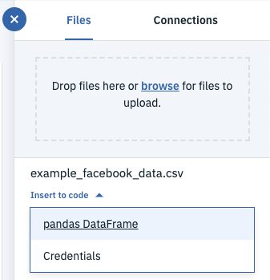

#  PixieDust 와 코그니티브 Jupyter notebook을 사용해 페이스북 숨은 인사이트 찾기

*다른 언어로 보기: [English](README.md).*

> 기존 아티클에서 사용했던 Data science Experience 플랫폼이 Watson Studio로 변경되었습니다. 
몇몇 이미지들이 Data Science Experience 버전이지만, 코드 패턴은 정상적으로 구동 가능합니다.

이 코드 패턴에서는, Jupyter notebook을 이용해서 많은 비정형 데이터로부터 인사이트를 도출합니다. 초기 노트북 설계 Credit은 [Anna Quincy](https://www.linkedin.com/in/anna-quincy-25042957) 와 [Tyler Andersen](https://www.linkedin.com/in/tyler-andersen-2bb82336) 에게 있습니다.

Facebook Analytics 에서 추출한 데이터를 바탕으로, Watson Natural Language Understanding (NLU) 서비스와 Tone Analyzer 및 Visual Recognition 을 적용합니다.

위의 기술을 적용하여 아래와 같은 문제를 해결할 수 있습니다:

> Engagement 성과가 높은 게시물에서 가장 많이 나타나는 감정은 무엇인가?

> 아티클 텍스트의 사회적인 분위기, 메인 아티클, engagement 성과 간에 어떤 관계가 존재하는가?

이러한 인사이트는 마케팅 애널리틱스가 브랜드 인지도, 제품 퍼포먼스, 고객 만족도, 타겟 오디언스의 참여 유도 등을 이해하고 개선하는데 큰 도움이 됩니다.

이 코드 패턴은 하나의 세팅된 어플리케이션이 아닌 참고용 가이드로 이해하는 것이 좋습니다. Facebook Analytics export 기능으로 포스팅의 텍스트, 아티클, 썸네일, 그리고 페이스북의 기본적인 퍼포먼스 매트릭스(좋아요, 공유, 도달율 등) 을 추출할 수 있습니다.이러한 비정형 데이터에 Watson APIs 를 접목하여 키워드, entities, 감정, 분위기 등을 분석할 수 있습니다. 

데이터에 Watson APIs 를 접목한 후, 여러가지 방법으로 분석할 수 있습니다. Watson Studio 는 강력하지만 유연한 페이스북 콘텐츠 탐색 방법을 제공합니다.

이 코드 패턴은 당신이 숨겨진 인사이트를 찾는 것을 바로 시도해볼 수 있도록 페이스북 데이터, Jupyter notebook, 시각화 샘플을 제공합니다.

이 코드 패턴을 이해하면 다음과 같은 내용을 이해할 수 있습니다:

* Object Storage 와 pandas 데이터 프레임을 통해 Jupyter Notebook으로 외부 데이터 읽어 오기
* 다음을 활용하여 Jupyter notebook, Watson APIs 로 비정형 데이터 가공하기:
  * [Natural Language Understanding](https://www.ibm.com/watson/services/natural-language-understanding/)
  * [Tone Analyzer](https://www.ibm.com/watson/services/tone-analyzer/)
  * [Visual Recognition](https://www.ibm.com/watson/services/visual-recognition/)
* Jupyter Notebook 안에서 pandas DataFrame 데이터를 입력하고 Object Storage 파일로 출력하기
* PixieDust 를 활용하여 데이터를 가공하고 시각화하기 


## 플로우

1. Facebook Analytics 에서 추출한 CSV 파일을 Object Storage 에 추가
2. 코드를 활용하여 pandas DataFrame 형태로 파일 액세스
3. 데이터에 Natural Language Understanding 기술 접목
4. 데이터에 Tone Analyzer 기술 접목
5. 데이터에 Visual Recognition 기술 접목
6. PixieDust를 활용하여 가공한 데이터를 탐색하고, 숨겨진 인사이트를 발견하여 그래픽으로 표현

## 포함된 구성 요소

* [IBM Watson Studio](https://www.ibm.com/cloud/watson-studio): Spark와 같은 IBM 추가 기능을 포함한 설정된 협엽 환경에서 RStudio, Jupyter, and Python 을 활용하여 데이터 분석
* [IBM Cloud Object Storage](https://console.bluemix.net/catalog/services/cloud-object-storage): 비정형 데이터 클라우드 저장 기능을 제공하는 IBM Cloud 서비스를 활용하여, 비용 대비 효율이 높고 신뢰할 수 있는 앱 또는 서비스를 구축 및 빠른 속도로 시장 진입
* [Watson Natural Language Understanding](https://www.ibm.com/watson/services/natural-language-understanding/): 고도화된 텍스트 분석을 위한 자연어 처리
* [Watson Tone Analyzer](https://www.ibm.com/watson/services/tone-analyzer/): 언어 분석을 통해 텍스트 내 대화 분위기를 탐지
* [Visual Recognition](https://www.ibm.com/watson/services/visual-recognition/): 이미지 콘텐츠 인식

## 주요 기술

* [Jupyter Notebooks](http://jupyter.org/): 오픈 소스인 웹 애플리케이션으로 즉시 실행 가능한 코드, 방정식, 시각화된 차트 및 설명이 포함된 문서를 만들고 공유할 수 있습니다.
* [PixieDust](https://github.com/pixiedust/pixiedust): 오픈 소스 헬퍼 라이브러리로 데이터 처리 사용자 경험을 향상시키는 Jupyter notebooks 의 추가 기능입니다.
* [pandas](http://pandas.pydata.org/): 파이썬 라이브러리로, 고성능의 사용하기 쉬운 데이터 구조를 제공합니다.
* [Beautiful Soup](https://www.crummy.com/software/BeautifulSoup/bs4/doc/): 파이썬 라이브러리로, HTML and XML 파일에서 데이터를 읽어옵니다.
* [Data Science](https://developer.ibm.com/code/technologies/data-science/): 시스템이자 과학적 방법으로, 정형 또는 비정형 데이터를 분석하고 지식이나 인사이트를 도출해 냅니다. 
* [Artificial Intelligence](https://developer.ibm.com/technologies/artificial-intelligence/): Watson 은 사람처럼 생각할 수 있는 인지 기술입니다. 
* [Analytics](https://developer.ibm.com/code/technologies/analytics/): Analytics delivers the value of data for the enterprise.
* [Python](https://www.python.org/): 당신의 시스템을 더욱 효과적으로 통합하고 빠르게 작업할 수 있는 프로그래밍 언어입니다. 

## 동영상 보기

[](https://www.youtube.com/watch?v=UIkjFo9o3vI)

## 단계

이 코드 패턴을 구성하고 실행하려면 다음의 단계를 따르십시오.
각 단계의 세부 사항이 아래에 설명되어 있습니다.

1. [Watson Studio 가입](#1-Watson-Studio-가입)
1. [프로젝트 생성 및 서비스 추가](#2-프로젝트-생성-및-서비스-추가)
1. [Watson Studio 에서 노트북 생성](#3-Watson-Studio-에서-노트북-생성)
1. [인증 정보 추가](#4-인증-정보-추가)
1. [CSV 파일 추가](#5-CSV-파일-추가)
1. [노트북 실행](#6-노트북-실행)
1. [기술 적용](#7-기술-적용)
1. [작업 저장](#8-작업-저장)

### 1. Watson Studio 가입

* IBM [Watson Studio](https://dataplatform.ibm.com) 에 가입하세요. Watson Studio 에서 프로젝트를 생성하면, IBM Cloud 계정에 무료 플랜의 ``Object Storage`` 서비스가 생성됩니다. 이어지는 단계에서 올바르게 선택하기 위해 당신이 만들고자 하는 서비스의 이름을 기억하세요.

  > 주의: Object Storage 서비스 생성 시 업그레이드 요금을 지불하지 않으려면 'Free storage type' 을 선택하세요. 

### 2. 프로젝트 생성 및 서비스 추가

* Watson Studio 에서 노트북을 포함하며 IBM Cloud 서비스와 연결된 새로운 프로젝트를 생성합니다.  `Data Science`  프로젝트 타일을 클릭하세요.
  
* 프로젝트에 Watson 서비스를 결합시킵니다. 각 서비스의 인스턴스를 생성하기 위해, 새 프로젝트에서 `Settings` 탭을 클릭하고 `Associated Services` 까지 스크롤을 내립니다. `Add service` 를 클릭하고 드롭다운 메뉴에서 `Watson` 을 클릭합니다. 무료 요금제 플랜을 이용하여 서비스를 추가합니다. 이러한 방식을 반복하여 아래의 서비스를 설치합니다:
  * Visual Recognition
  * Natural Language Understanding
  * Tone Analyzer

* 서비스가 생성된 후에, credential 을 복사하여 나중을 위해 저장해 두세요. Jupyter notebook 에서 차후에 활용하게 될 것입니다.
  * 좌측 상단 `☰` 메뉴에서, `Services > Watson Services` 를 선택합니다.
  * 3개 점으로 이루어진 actions menu 를 이용하여 각 서비스의 `Manage in IBM Cloud` 를 클릭합니다.
  * 각 서비스의  `API Key` 와 `URL` 을 노트북에서 사용하기 위해 복사해 둡니다.

### 3. Watson Studio 에서 노트북 생성

* [Watson Studio](https://dataplatform.ibm.com)에서 `+ Add to project` 탭을 이용하여 `Notebook` 타일을 클릭합니다.
  
* `From URL` 탭을 선택합니다.
* 노트북 이름을 입력합니다.
* 노트북에 관한 상세 설명을 입력합니다 (선택 사항).
* 아래의 노트북 URL을 입력합니다:  
  `https://raw.githubusercontent.com/IBM/pixiedust-facebook-analysis/master/notebooks/pixiedust_facebook_analysis.ipynb`
* runtime 항목으로는 `Default Python 3.5 Free (1 vCPU and 4 GB RAM)` 을 선택합니다.
* `Create Notebook` 버튼을 클릭합니다.

### 4. 인증 정보 추가

`1.5. Add Service Credentials From IBM Cloud for Watson Services` 하단의 노트북 셀을 찾습니다.

`<add_...>` 형태의 5개 placeholder 값을 각 서비스의 `Service Credentials` 탭에서 가져온 정보로 대체합니다.


> 주의: 이 셀은 credential 민감 정보를 포함하기 때문에 hidden_cell 로 표시됩니다.

### 5. CSV 파일 추가

#### 노트북에 CSV 파일 추가

`Find and Add Data` 기능의 `Files` 탭을 이용합니다(`10/01` 아이콘을 찾으세요).
`browse` 를 클릭하여 `.csv` 파일을 추가하세요.


> 주의: 만일 당신이 가지고 있는 데이터가 없다면, git 저장소를 복제하여 예시 데이터를 사용할 수 있습니다. 
data/example_input 를 찾아보세요. 

#### 코드 삽입

`2.1 Load data from Object Storage` 하단의 노트북 셀을 찾습니다. 커서를 `# Insert pandas DataFrame` 에 위치시킵니다. 코드를 삽입하기 전 이 셀을 선택했는지 반드시 확인하세요. 

위에서 추가했던 파일을 이용하여 (`10/01` 파일 탭 하단),
`Insert to code` 를 클릭하여 드롭다운 메뉴를 선택합니다.
드롭다운 메뉴의 `Insert Pandas DataFrame` 을 선택합니다.



>주의: 이 셀은 credential 민감 정보를 포함하기 때문에 hidden_cell 로 표시됩니다.


> Note: non utf-8 인코딩의 경우 [오류](https://github.com/IBM/pixiedust-facebook-analysis/issues/39)가 발생할 수 있으며 추가 작업이 필요합니다. read_csv() 함수에 파라미터를 추가함으로써 셀에서 오류를 수정할 수 있습니다. 제공하는 예시인 `example_facebook_data.csv` 파일의 경우 아래와 같이 적용할 수 있습니다:

```python
df_data_1 = pd.read_csv(body, encoding='latin-1')
```

#### df 변수명 수정

삽입한 코드는 인증 정보를 가진 메소드를 포함합니다. 
그리고 메소드를 호출하여 `df_data_1` 라는 변수를 설정합니다.
만일 당신이 추가적으로 삽입한다면, 메소드는 재사용할 수 있고 변수의 이름은 변경됩니다. 
(예: `df_data_2`).

이후 노트북에서 `df = df_data_1` 라고 설정할 것입니다.
따라서 당신은 삽입 코드와 일치시키기 위해 변수명을 `df_data_1` 으로 수정해야 할 수 있습니다.

#### 파일 인증 정보 추가

파일을 쓰고 위에서 사용했던 컨테이너로 불러옵니다. 인증 정보를 삽입하기 위해 똑같은 파일 드롭 다운 메뉴를 사용합니다. 인증 정보는 차후 CSV 파일을 쓸 때 사용됩니다. 

`df` 변수를 설정한 후, 파일 인증 정보를 입력하기 위한 셀이 있습니다. 
커서를 `#insert credentials for file - Change to credentials_1` 에 위치 시킵니다. 인증 정보를 삽입하기 전 이 셀을 선택했는지 반드시 확인하세요. 

CSV 파일의 드롭 다운 메뉴를 다시 사용합니다. 이번에는 `Insert Credentials` 을 선택합니다.


주의: 이 셀은 credential 민감 정보를 포함하기 때문에 hidden_cell 로 표시됩니다.

#### Credential 변수 명 수정

삽입한 코드는 `credentials_1` 변수에 할당된 인증 정보 dictionary 를 포함합니다.
이 변수는 다른 이름을 가질 수도 있습니다. (예: `credentials_2`).
필요하다면 이름을 변경하세요. 이 노트북은 해당 변수를 `credentials_1` 으로 가정합니다. 

## 6. 노트북 실행

노트북을 실행하면, 노트북 각 셀의 코드가 위에서부터 아래로 순서대로 실행됩니다.

각 코드 셀은 선택할 수 있으며 왼쪽 여백에 태그가 붙어 있습니다. 
태그 형식은 `In [x]:` 입니다. 노트북의 상태에 따라, `x` 는 아래와 같이 나타납니다:

* 아무것도 표시되지 않은 빈 칸일 경우, 이 셀은 실행되지 않았습니다.
* 숫자가 표시될 경우, 이 숫자는 코드가 실행된 순서를 의미합니다. 
* `*` 가 표시될 경우, 이 셀이 현재 실행 중임을 의미합니다.

노트북에서 코드를 실행하는 몇몇 방법들:

* 한 번에 한 셀을 작동시킬 경우
  * 셀을 선택하고, 툴바의 `Play` 버튼을 누른다.
* 순차적인 순서대로 한꺼번에 여러 셀을 작동시킬 경우
  * `Cell` 메뉴 바에서, 몇몇 옵션을 이용할 수 있습니다.
    예를 들어, `Run All` 을 선택하여 노트북의 모든 셀을 실행 할 수 있고,
    `Run All Below` 을 선택하여 현재 선택된 셀 아래의 모든 셀을 작동 시킬 수 있습니다.
* 정해진 시간에 작동시킬 경우
  * 노트북 패널 우상단에 위치한 `Schedule` 버튼을 클릭합니다.
    향후 특정 시간에 노트북이 작동하도록 예약할 수 있으며,
    특정 간격을 두고 반복하도록 설정 할 수 있습니다.
    
## 7. 결과 분석

### Part I - 기술 적용

위에서 작업한 셀을 확인해보면, Part 1 항목들을 어떻게 실행하는지 알 수 있습니다:

* PyPI 에서 외부 라이브러리 설치
* 클라이언트를 생성 및 Watson 코그니티브 서비스에 연결
* Object Storage를 통해 로컬 CSV 파일에서 pandas 데이터 프레임으로 데이터 불러오기
* pandas를 활용하여 데이터 처리
* BeautifulSoup 사용
* Natural Language Understanding 적용
* Use Tone Analyzer 적용
* Visual Recognition 적용
* 여러 기술이 접목된 데이터를 Object Storage에 CSV 파일로 저장

### Part II - 데이터 준비

In Part II, pandas를 사용하여 여러 기술이 접목된 데이터 프레임으로부터 다양한 데이터 프레임들을 생성합니다. 데이터 슬라이싱, 클렌징 후에 이 새로운 데이터 프레임들에 PixieDust 를 적용할 수 있습니다. 

### Part III - 분석

Part III 에서는, PixieDust를 활용하여 매트릭스를 탐색 및 시각화 함으로써 결과를 분석합니다. 

사전 준비 작업을 마친 후, 이 단계에서는 PixieDust 를 활용하기 때문에 추가적인 코드가 거의 필요하지 않습니다.
아래와 같은 한 줄의 코드만 쓰면 됩니다:

```python
display(<data-frame>)
```

두 개의 서로 다른 셀에서 ```display(tones)``` 를 사용하여,
두 개의 다른 차트로 결과를 표시합니다. 어떻게 이런 일이 가능할까요?
셀 메타 데이터를 사용하여 PixieDust가 데이터를 표현하도록 합니다.
각 셀마다 `Edit Metadata` 버튼이 있습니다.
버튼이 보지 않는다면, 메뉴에서 `View > Cell Toolbar > Edit Metadata` 를 사용하여 표시할 수 있습니다.
두 개 차트의 메타 데이터를 확인하면 어떻게 막대 그래프와 원 그래프를 만드는지 이해할 수 있습니다. 

**PixieDust는 인터랙티브 서비스입니다!**  이 서비스를 이용해 데이터가 말하고자 하는 것을 찾아낼 수 있습니다. 

`Options` 버튼을 클릭하여 그래프 설정을 변경합니다. 
첫 번째 그래프는 이 아티클에서 탐지된 감정 소비 정도를 나타냅니다.
집적 방식을 SUM에서 AVG로 변경 했을 때 결과가 얼마나 달라지는지 알아보세요.
변경하며 각 감정의 빈도를 측정해 보세요. 변경 시 매트릭스는 크게 중요하지 않습니다. 


아래와 같은 항목을 시도해 보세요:

* 감정 대신 분위기를 key로 사용하기
* 다른 유저들로부터 부정적인 피드백과 같은 다른 매트릭스 채택하기 
* 다른 renderer 시도하기
* 다른 그리드 혹은 그래프 타입 사용하기

적절한 콤비네이션으로 당신의 페이스북 포스팅에 대한 인사이트를 얻어보세요. 
인사이트를 발견해내고, 다른 사람들을 설득할 수 있는 최고의 프레젠테이션 방법을 찾아보세요. 


## 8. 작업 저장

### 작업을 저장하는 방법

`File` 메뉴에서 여러가지 방법으로 노트북을 저장할 수  있습니다:

* `Save` 의 경우 버전 정보없이 단순히 노트북의 현재 상태를 저장하는 것입니다. 
* `Save Version` 은 현재 노트북의 상태를 날짜, 시간 스탬프가 포함된 버전 태그와 함께 저장합니다.
   10개 버전까지 저장이 가능하며, 각 버전은 `Revert To Version` 메뉴 아이템에서 선택하여 복구가 가능합니다.

## 샘플 산출물

`data/examples`  안의 샘플 산출물은 PixieDust 차트를 위한 JavaScript를 포함하고 있습니다. 
[이 링크](http://nbviewer.jupyter.org/github/IBM/pixiedust-facebook-analysis/blob/master/data/examples/pixiedust_facebook_analysis.ipynb)에서 niviewer를 사용하여 확인할 수 있습니다.

> Note: Some interactive functionality might not work in the saved example. Run the notebook for full functionality. To see the code and markdown cells without output, you can view [notebooks/pixiedust_facebook_analysis.ipynb](notebooks/pixiedust_facebook_analysis.ipynb) with the Github viewer.

## Links

* [유튜브 데모](https://www.youtube.com/watch?v=UIkjFo9o3vI)
* [PixieDust 도큐먼트](https://pixiedust.github.io/pixiedust/)
* [PixieDust GitHub 저장소](https://github.com/pixiedust/pixiedust)
* [Watson Accelerators](http://www.watsonaccelerators.com)
* [Cognitive discovery architecture](https://www.ibm.com/cloud/garage/architectures/cognitiveDiscoveryDomain)
* [Facebook Analytics Developer 문서](https://developers.facebook.com/docs/analytics)
* [Watson APIs를 활용하여 몬스터 친구 로봇 만들기](https://medium.com/ibm-watson/a-robot-befriends-classic-monsters-using-watson-apis-part-1-76b1cc64957e)

## Learn more

* **인공지능 코드 패턴**: 이 코드 패턴이 마음에 드시나요? [AI Code Patterns](https://developer.ibm.com/technologies/artificial-intelligence/)을 확인해 보세요
* **데이터 분석 코드 패턴**: 이 코드 패턴이 마음에 드시나요? [Data Science Code Patterns](https://developer.ibm.com/technologies/data-science/)을 확인해 보세요
* **인공지능, 데이터 코드 패턴 플레이 리스트**: 모든 코드 패턴 비디오가 포함된 [플레이리스트](https://www.youtube.com/playlist?list=PLzUbsvIyrNfknNewObx5N7uGZ5FKH0Fde)를 북마크 하세요 
* **Watson 활용**: Watson app 을 더욱 심도깊게 사용하고 싶으신가요? Watson 브랜드 자산을 활용하고 싶으신가요? [Watson 프로그램](https://www.ibm.com/watson/with-watson/)에 참여하여 독점 브랜드, 마케팅, 기술 자원을 이용하고 당신의 Watson 결합 상업 솔루션을 강화해 보세요. 
* **Watson Studio**: IBM [Watson Studio](https://dataplatform.ibm.com/)를 활용하여 데이터 사이언스 마스터 하기  

## License

[Apache License, Version 2](https://www.apache.org/licenses/LICENSE-2.0.txt).

[Apache License FAQ](https://www.apache.org/foundation/license-faq.html#WhatDoesItMEAN)