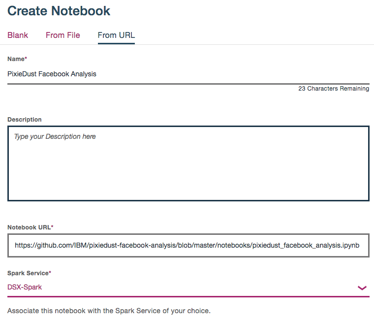

# Uncover insights from Facebook with PixieDust and a cognitive Jupyter notebook

In this developer journey, we will use a Jupyter notebook to glean insights from a vast body of unstructured data.

We'll start with data exported from Facebook Analytics. We'll enrich the data with Watson’s Natural Language Understanding (NLU), Tone Analyzer and Visual Recognition.

We'll use the enriched data to answer questions like:

> What sentiment is most prevalent in the posts with the highest engagement performance?

> What are the relationships between social tone of article text, the main article entity, and engagement performance?

These types of insights are especially beneficial for marketing analysts who are interested in understanding and improving brand perception, product performance, customer satisfaction, and ways to engage their audiences.

It is important to note that this journey is meant to be used as a guided experiment, rather than an application with one set output. The standard Facebook Analytics export features text from posts, articles, and thumbnails, along with standard Facebook performance metrics such as likes, shares, and impressions. This unstructured content was then enriched with Watson APIs to extract keywords, entities, sentiment, and tone.

After data is enriched with Watson APIs, there are several different types of ways to analyze it. The Data Science Experience (DSX) provides a robust, yet flexible method of exploring the unstructured, enriched Facebook content.

This journey provides mock Facebook data, a notebook, and comes with several pre-built visualizations to jump start you with uncovering hidden insights.

When the reader has completed this journey, they will understand how to:

 * Read external data in to a DSX Jupyter notebook via DSX Object Storage and pandas DataFrames.
 * Use a Jupyter notebook and Watson APIs to enrich data unstructured data using:
     * [Visual Recognition](https://www.ibm.com/watson/developercloud/visual-recognition.html)
     * [Natural Language Understanding](https://www.ibm.com/watson/developercloud/natural-language-understanding.html)
     * [Tone Analyzer](https://www.ibm.com/watson/developercloud/tone-analyzer.html)
 * Write data from a pandas DataFrame in a DSX Jupyter notebook out to a file in DSX Object Storage.
 * Visualize and explore the enriched data with [PixieDust](https://github.com/ibm-cds-labs/pixiedust).


## Flow
1. A CSV file exported from Facebook Analytics is added to DSX Object Storage.
2. Generated code makes the file accessible as a pandas DataFrame.
3. The data is enriched with Tone Analyzer.
4. The data is enriched with Natural Language Understanding.
5. The data is enriched with Visual Recognition.
6. The enriched data can be explored with PixieDust to uncover hidden insights and create graphics to highlight them.

## With Watson

Want to take your Watson app to the next level? Looking to leverage Watson Brand assets? Join the [With Watson](https://www.ibm.com/watson/with-watson) program which provides exclusive brand, marketing, and tech resources to amplify and accelerate your Watson embedded commercial solution.

# Included components

* [IBM Data Science Experience](https://www.ibm.com/bs-en/marketplace/data-science-experience): Analyze data using RStudio, Jupyter, and Python in a configured, collaborative environment that includes IBM value-adds, such as managed Spark.
* [Bluemix Object Storage](https://console.ng.bluemix.net/catalog/services/object-storage/?cm_sp=dw-bluemix-_-code-_-devcenter): A Bluemix service that provides an unstructured cloud data store to build and deliver cost effective apps and services with high reliability and fast speed to market.
* [Watson Tone Analyzer](https://www.ibm.com/watson/developercloud/tone-analyzer.html): Uses linguistic analysis to detect communication tones in written text.
* [Watson Natural Language Understanding](https://www.ibm.com/watson/developercloud/natural-language-understanding.html): Natural language processing for advanced text analysis.
* [Visual Recognition](https://www.ibm.com/watson/developercloud/visual-recognition.html): Understand image content.

# Featured technologies

* [Jupyter Notebooks](http://jupyter.org/): An open-source web application that allows you to create and share documents that contain live code, equations, visualizations and explanatory text.
* [PixieDust](https://github.com/ibm-cds-labs/pixiedust): PixieDust is an open source helper library that works as an add-on to Jupyter notebooks to improve the user experience of working with data.
* [pandas](http://pandas.pydata.org/): A Python library providing high-performance, easy-to-use data structures.
* [Beautiful Soup](https://www.crummy.com/software/BeautifulSoup/bs4/doc/): Beautiful Soup is a Python library for pulling data out of HTML and XML files.
* [Data Science](https://developer.ibm.com/code/technologies/data-science/): Systems and scientific methods to analyze structured and unstructured data in order to extract knowledge and insights.
* [Cognitive](https://developer.ibm.com/watson/): Watson is a cognitive technology that can think like a human.
* [Analytics](https://developer.ibm.com/code/technologies/analytics/): Analytics delivers the value of data for the enterprise.
* [Python](https://www.python.org/): Python is a programming language that lets you work more quickly and integrate your systems more effectively.

# Watch the Video

[](https://www.youtube.com/watch?v=UIkjFo9o3vI)

# Steps

Follow these steps to setup and run this developer journey. The steps are
described in detail below.

1. [Sign up for the Data Science Experience](#1-sign-up-for-the-data-science-experience)
1. [Create the notebook](#2-create-the-notebook)
1. [Create Bluemix services](#3-create-bluemix-services)
1. [Add credentials](#4-add-credentials)
1. [Add the CSV file](#5-add-the-csv-file)
1. [Run the notebook](#6-run-the-notebook)
1. [Analyze the results](#7-analyze-the-results)
1. [Save your work](#8-save-your-work)

## 1. Sign up for the Data Science Experience

Sign up for IBM's [Data Science Experience](http://datascience.ibm.com/). By signing up for the Data Science Experience, two services: ``DSX-Spark`` and ``DSX-ObjectStore`` will be created in your Bluemix account.

## 2. Create the notebook

You can create the notebook in DSX using the URL of the notebook that is in this git repo (or similarly from a local file if you cloned the repo).

1. Use the menu on the left to select `My Projects` and then `Default Project`.
1. Click on `Add notebooks` (upper right) to create a notebook.
1. Select the `From URL` tab.
1. Enter a name for the notebook.
1. Optionally, enter a description for the notebook.
1. Enter this Notebook URL:
    ```
    https://github.com/IBM/pixiedust-facebook-analysis/blob/master/notebooks/pixiedust_facebook_analysis.ipynb
    ```
1. Click the `Create Notebook` button.



## 3. Create Bluemix services

Create the following Bluemix services by clicking the `Deploy to Bluemix` button, or use these links to create the services in the Bluemix UI.

  * [**Visual Recognition**](https://console.ng.bluemix.net/catalog/services/visual-recognition)
  * [**Natural Language Understanding**](https://console.ng.bluemix.net/catalog/services/natural-language-understanding)
  * [**Tone Analyzer**](https://console.ng.bluemix.net/catalog/services/tone-analyzer)
  
[](https://bluemix.net/deploy?repository=https://github.com/ibm/pixiedust-facebook-analysis)

## 4. Add credentials

Find the notebook cell after `1.5. Add Service Credentials From Bluemix for Watson Services`.

Replace the five <add_...> placeholder values with information from the `Service Credentials` tab in Bluemix. Use your Bluemix dashboard to find each of the services and click on the `Service Credentials` tab. In some cases, you might need to create credentials with the `New Credential` option.


> Note: This cell is marked as a `hidden_cell` because it will contain sensitive credentials.

## 5. Add the CSV file

#### Add the CSV file to the notebook
Use `Find and Add Data` (look for the `10/01` icon)
and its `Files` tab. From there you can click
`browse` and add a .csv file from your computer.


> Note:  If you don't have your own data, you can get our example by cloning
this git repo. Look in the `data/example_input` directory.

#### Insert to code
Find the notebook cell after `2.1 Load data from Object Storage`. Place your cursor after `# Insert pandas DataFrame`. Make sure this cell is selected before inserting code.

Using the file that you added above (under the 10/01 Files tab),
use the `Insert to code` drop-down menu.
Select `Insert Pandas DataFrame` from the drop-down menu.


> Note: This cell is marked as a hidden_cell because it contains
sensitive credentials.


#### Fix-up variable names
The inserted code includes a generated method with credentials and then calls
the generated method to set a variable with a name like `df_data_1`. If you do
additional inserts, the method can be re-used and the variable will change
(e.g. `df_data_2`).

Later in the notebook, we set `df = df_data_1`. So you might need to
fix the variable name `df_data_1` to match your inserted code or vice versa.

#### Add file credentials

We want to write the enriched file to the same container that we used above. So now we'll use the same file drop-down to insert credentials. We'll use them later when we write out the enriched CSV file.

After the `df` setup, there is a cell to enter the file credentials.
Place your cursor after the `#insert credentials for file - Change to credentials_1` line. Make sure this cell is selected before inserting credentials.

Use the CSV file's drop-down menu again. This time select `Insert Credentials`.


Note: This cell is marked as a `hidden_cell` because it contains sensitive credentials.

#### Fix-up variable names
The inserted code includes a dictionary with credentials assigned to a variable
with a name like `credentials_1`. It may have a different name (e.g. `credentials_2`).
Rename it or reassign it if needed. The notebook code assumes it will be `credentials_1`.

## 6. Run the notebook

When a notebook is executed, what is actually happening is that each code cell in
the notebook is executed, in order, from top to bottom.

Each code cell is selectable and is preceded by a tag in the left margin. The tag
format is `In [x]:`. Depending on the state of the notebook, the `x` can be:

* A blank, this indicates that the cell has never been executed.
* A number, this number represents the relative order this code step was executed.
* A `*`, this indicates that the cell is currently executing.

There are several ways to execute the code cells in your notebook:

* One cell at a time.
  * Select the cell, and then press the `Play` button in the toolbar.
* Batch mode, in sequential order.
  * From the `Cell` menu bar, there are several options available. For example, you
    can `Run All` cells in your notebook, or you can `Run All Below`, that will
    start executing from the first cell under the currently selected cell, and then
    continue executing all cells that follow.
* At a scheduled time.
  * Press the `Schedule` button located in the top right section of your notebook
    panel. Here you can schedule your notebook to be executed once at some future
    time, or repeatedly at your specified interval.

## 7. Analyze the results

### Part I - Enrich

If you walk through the cells, you will see that we demonstrated how to do the following in Part I:

* Install external libraries from PyPI
* Create clients to connect to Watson cognitive services
* Load data from a local CSV file to a pandas DataFrame (via Object Storage)
* Do some data manipulation with pandas
* Use BeautifulSoup
* Use Visual Recognition
* Use Tone Analyzer
* Use Natural Language Understanding
* Save the enriched data in a CSV file in Object Storage

### Part II - Data Preparation

In Part II, we used pandas to create multiple DataFrames from our main enriched DataFrame. After slicing and dicing and cleaning, these new DataFrames are ready for PixieDust to use.

### Part III - Analyze

In Part III, we analyze the results by exploring and visualizing the metrics with PixieDust.

After all the prep work done earlier, you'll see that there is almost no code
needed here (thanks to PixieDust). We just use one-liners like this:
```python
display(<data-frame>)
```

You should also notice that we used ```display(tones)``` in two different
cells, but the result was two different charts. How can that happen?
Well, we used cell metadata to tell PixieDust how to display the data.
Notice the `Edit Metadata` button on each cell. If you don't see it, use the menu
`View > Cell Toolbar > Edit Metadata` to make it visible. If you look at
the metadata for the first two charts, you'll see how we got a bar chart and a pie chart.

**PixieDust is interactive!** This is where we explore to find out what
the enriched data will tell us.

Use the `Options` button to change the chart settings. The first chart shows
post consumption by the detected emotion in the article. Notice how changing
the aggregation type from SUM to AVG gives you a very different conclusion.
You can also change it to COUNT to see the frequency of each emotion, but when you do that the metric no longer matters.

Explore by trying the following:
* Use social tone as the key instead of emotion tone (or both).
* Try other metrics such as lifetime negative feedback from users. 
* Try the different renderers.
* Try different chart types (and a grid).

The right combination will give you insights into the impact of
your facebook posts. Once you uncover the insights, find the best
presentation to convince others.

## 8. Save your work

### How to save your work:

Under the `File` menu, there are several ways to save your notebook:

* `Save` will simply save the current state of your notebook, without any version
  information.
* `Save Version` will save your current state of your notebook with a version tag
  that contains a date and time stamp. Up to 10 versions of your notebook can be
  saved, each one retrievable by selecting the `Revert To Version` menu item.

# Sample output

The example output in data/examples has embedded JavaScript for
PixieDust charts. View it via github pages: [here](https://ibm.github.io/pixiedust-facebook-analysis/data/examples/pixiedust_facebook_analysis.html)

> Note: Some interactive functionality does not work in the HTML sample. Run the notebook for full functionality. To see the code and markdown cells without output, you can view [notebooks/pixiedust_facebook_analysis.ipynb](notebooks/pixiedust_facebook_analysis.ipynb) with the github viewer.

# License

[Apache 2.0](LICENSE)
