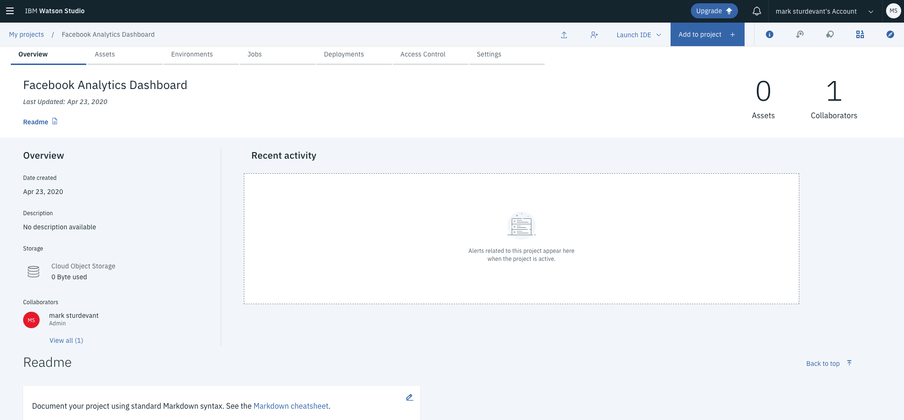
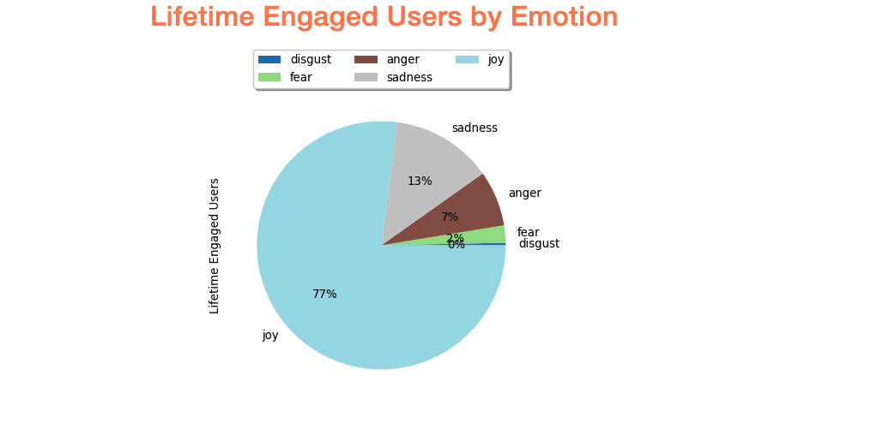

# Uncover insights from Facebook data with Watson services

In this code pattern, we will use a Jupyter notebook to glean insights from a vast body of unstructured data. We'll start with data exported from Facebook Analytics. We'll use Watson Studio and enrich the data with Watson’s Natural Language Understanding (NLU) and Visual Recognition.

We'll use the enriched data to answer questions like:

> What emotion is most prevalent in the posts with the highest engagement?

> What sentiment has the higher engagement score on average?

> What are the top keywords, entities or images measured by total reach?

These types of insights are especially beneficial for marketing analysts who are interested in understanding and improving brand perception, product performance, customer satisfaction, and ways to engage their audiences.

It is important to note that this code pattern is meant to be used as a guided experiment, rather than an application with one set output. The standard Facebook Analytics export features text from posts, articles, and thumbnails, along with standard Facebook performance metrics such as likes, shares, and impressions. This unstructured content was then enriched with Watson APIs to extract keywords, entities, sentiment, and emotion.

After data is enriched with Watson APIs, there are several different types of ways to analyze it. Watson Studio provides a robust, yet flexible method of exploring the unstructured, enriched Facebook content.

This code pattern provides mock Facebook data, a notebook, and comes with several pre-built visualizations to jump start you with uncovering hidden insights.

When the reader has completed this code pattern, they will understand how to:

* Read external data in to a Jupyter Notebook via Object Storage and pandas DataFrames.
* Use a Jupyter notebook and Watson APIs to enrich unstructured data.
* Write data from a pandas DataFrame in a Jupyter Notebook out to a file in Object Storage.
* Visualize and explore the enriched data.

## Flow


1. A CSV file exported from Facebook Analytics is added to Object Storage.
1. Generated code makes the file accessible as a pandas DataFrame.
1. The data is enriched with Natural Language Understanding.
1. The data is enriched with Tone Analyzer.
1. The data is enriched with Visual Recognition.
1. Visualize the enriched data to uncover hidden insights and create graphics to highlight them.

## Included components

* [IBM Watson Studio](https://dataplatform.cloud.ibm.com): Analyze data using RStudio, Jupyter, and Python in a configured, collaborative environment that includes IBM value-adds, such as managed Spark.
* [IBM Cloud Object Storage](https://cloud.ibm.com/catalog/services/cloud-object-storage): An IBM Cloud service that provides an unstructured cloud data store to build and deliver cost effective apps and services with high reliability and fast speed to market.
* [Watson Natural Language Understanding](https://www.ibm.com/watson/services/natural-language-understanding/): Natural language processing for advanced text analysis.
* [Watson Visual Recognition](https://www.ibm.com/watson/services/visual-recognition/): Understand image content.
* [Jupyter Notebooks](https://jupyter.org/): An open-source web application that allows you to create and share documents that contain live code, equations, visualizations and explanatory text.
* [pandas](https://pandas.pydata.org/): A Python library providing high-performance, easy-to-use data structures.
* [Beautiful Soup](https://www.crummy.com/software/BeautifulSoup/bs4/doc/): Beautiful Soup is a Python library for pulling data out of HTML and XML files.

## Steps

Follow these steps to setup and run this code pattern. The steps are
described in detail below.

1. [Create a new Watson Studio project](#1-create-a-new-watson-studio-project)
1. [Add services to the project](#2-add-services-to-the-project)
1. [Create the notebook in Watson Studio](#3-create-the-notebook-in-watson-studio)
1. [Add credentials](#4-add-credentials)
1. [Add the CSV file](#5-add-the-csv-file)
1. [Run the notebook](#6-run-the-notebook)
1. [Analyze the results](#7-analyze-the-results)
1. [Save your work](#8-save-your-work)

### 1. Create a new Watson Studio project

* Log into IBM's [Watson Studio](https://dataplatform.cloud.ibm.com). Once in, you'll land on the dashboard.

* Create a new project by clicking `New project +` and then click on `Create an empty project`.

* Enter a project name.

* Choose and existing Object Storage instance or create a new one.

* Click `Create`.

* Upon a successful project creation, you are taken to the project `Overview` tab. Take note of the `Assets` and `Settings` tabs, we'll be using them to associate our project with any external assets (datasets and notebooks) and any IBM cloud services.

  

### 2. Add services to the project

* Associate the project with Watson services. To create an instance of each service, go to the `Settings` tab in the new project and scroll down to `Associated Services`. Click `Add service` and select `Watson` from the drop-down menu. Add the service using the free `Lite` plan. Repeat for each of the services used in this pattern:

  * Natural Language Understanding
  * Visual Recognition (optional)

* Once your services are created, copy the credentials and save them for later. You will use them in your Jupyter notebook.

  * Use the upper-left `☰` menu, and select `Services > Watson Services`.
  * Use the 3-dot actions menu to select `Manage in IBM Cloud` for each service.
  * Copy each `API Key` and `URL` to use in the notebook.

### 3. Create the notebook in Watson Studio

* From the new project `Overview` tab, click `+ Add to project` on the top right and choose the `Notebook` asset type.

  

* Fill in the following information:

  * Select the `From URL` tab. [1]
  * Enter a `Name` for the notebook and optionally a description. [2]
  * For `Select runtime` select the `Default Python 3.6 Free` option. [3]
  * Under `Notebook URL` provide the following url [4]:
    ```url
    https://raw.githubusercontent.com/IBM/pixiedust-facebook-analysis/master/notebooks/pixiedust_facebook_analysis.ipynb
    ```

  

* Click the `Create notebook` button.

  > **TIP:** Your notebook will appear in the `Notebooks` section of the `Assets` tab.

### 4. Add credentials

Find the notebook cell after `1.5. Add Service Credentials From IBM Cloud for Watson Services`.

Set the API key and URL for each service.


> **Note**: This cell is marked as a `hidden_cell` because it will contain sensitive credentials.

### 5. Add the CSV file

#### Add the CSV file to the notebook

Use `Find and Add Data` (look for the `01/00` icon) and its `Files` tab. From there you can click `browse` and add a `.csv` file from your computer.


> **Note**:  If you don't have your own data, you can use our example by cloning this git repo. Look in the `data` directory.

#### Insert to code

Find the notebook cell after `2.1 Load data from Object Storage`. Place your cursor after `# **Insert to code > Insert pandas DataFrame**`. Make sure this cell is selected before inserting code.

Using the file that you added above (under the `01/00` Files tab), use the `Insert to code` drop-down menu. Select `pandas DataFrame` from the drop-down menu.


> **Note**: This cell is marked as a `hidden_cell` because it contains
sensitive credentials.


#### Fix-up df variable name

The inserted code includes a generated method with credentials and then calls the generated method to set a variable with a name like `df_data_1`. If you do additional inserts, the method can be re-used and the variable will change (e.g. `df_data_2`).

Later in the notebook, we set `df = df_data_1`. So you might need to fix the variable name `df_data_1` to match your inserted code or vice versa.

#### Add file credentials

We want to write the enriched file to the same container that we used above. So now we'll use the same file drop-down to insert credentials. We'll use them later when we write out the enriched CSV file.

After the `df` setup, there is a cell to enter the file credentials. Place your cursor after the `# insert credentials for file - Change to credentials_1` line. Make sure this cell is selected before inserting credentials.

Use the CSV file's drop-down menu again. This time select `Insert Credentials`.


> **Note**: This cell is marked as a `hidden_cell` because it contains sensitive credentials.

#### Fix-up credentials variable name

The inserted code includes a dictionary with credentials assigned to a variable with a name like `credentials_1`. It may have a different name (e.g. `credentials_2`). Rename it or reassign it if needed. The notebook code assumes it will be `credentials_1`.

## 6. Run the notebook

When a notebook is executed, what is actually happening is that each code cell in the notebook is executed, in order, from top to bottom.

Each code cell is selectable and is preceded by a tag in the left margin. The tag format is `In [x]:`. Depending on the state of the notebook, the `x` can be:

* A blank, this indicates that the cell has never been executed.
* A number, this number represents the relative order this code step was executed.
* A `*`, this indicates that the cell is currently executing.

There are several ways to execute the code cells in your notebook:

* One cell at a time.
  * Select the cell, and then press the `Play` button in the toolbar.
* Batch mode, in sequential order.
  * From the `Cell` menu bar, there are several options available. For example, you can `Run All` cells in your notebook, or you can `Run All Below`, that will start executing from the first cell under the currently selected cell, and then continue executing all cells that follow.
* At a scheduled time.
  * Press the `Schedule` button located in the top right section of your notebook panel. Here you can schedule your notebook to be executed once at some future time, or repeatedly at your specified interval.

## 7. Analyze the results

### Part I - Enrich

If you walk through the cells, you will see that we demonstrated how to do the following in Part I:

* Install external libraries from PyPI
* Create clients to connect to Watson cognitive services
* Load data from a local CSV file to a pandas DataFrame (via Object Storage)
* Do some data manipulation with pandas
* Use BeautifulSoup
* Use Natural Language Understanding
* Use Visual Recognition
* Save the enriched data in a CSV file in Object Storage

### Part II - Data Preparation

In Part II, we used pandas to create multiple DataFrames from our main enriched DataFrame.

### Part III - Analyze

In Part III, we analyze the results by exploring and visualizing the metrics.

After all the prep work done earlier, you'll see that there is almost no code needed here. We just use one-liners like this:

```python
display(<data-frame>)
```

You should also notice that we used ```display(tones)``` in two different cells, but the result was two different charts. How can that happen? Well, we used cell metadata to tell PixieDust how to display the data. Notice the `Edit Metadata` button on each cell. If you don't see it, use the menu `View > Cell Toolbar > Edit Metadata` to make it visible. If you look at the metadata for the first two charts, you'll see how we got a bar chart and a pie chart.




**PixieDust is interactive!** This is where we explore to find out what the enriched data will tell us.

Use the `Options` button to change the chart settings. The first chart shows post consumption by the detected emotion in the article. Notice how changing the aggregation type from SUM to AVG gives you a very different conclusion. You can also change it to COUNT to see the frequency of each emotion, but when you do that the metric no longer matters.

Explore by trying the following:

* Use emotion as the key instead of sentiment (or both).
* Try other metrics such as lifetime negative feedback from users.
* Try the different renderers.
* Try different chart types (and a grid).

The right combination will give you insights into the impact of your facebook posts. Once you uncover the insights, find the best presentation to convince others.

## 8. Save your work

### How to save your work

Under the `File` menu, there are several ways to save your notebook:

* `Save` will simply save the current state of your notebook, without any version information.
* `Save Version` will save your current state of your notebook with a version tag that contains a date and time stamp. Up to 10 versions of your notebook can be saved, each one retrievable by selecting the `Revert To Version` menu item.

## Sample output

The example output in [`examples`](examples) has embedded JavaScript for charts. View it via nbviewer [here](https://nbviewer.jupyter.org/github/IBM/pixiedust-facebook-analysis/blob/master/examples/pixiedust_facebook_analysis.ipynb).

> **Note**: Some interactive functionality might not work in the saved example. Run the notebook for full functionality. To see the code and markdown cells without output, you can view [notebooks/pixiedust_facebook_analysis.ipynb](notebooks/pixiedust_facebook_analysis.ipynb) with the Github viewer.

## License

This code pattern is licensed under the Apache License, Version 2. Separate third-party code objects invoked within this code pattern are licensed by their respective providers pursuant to their own separate licenses. Contributions are subject to the [Developer Certificate of Origin, Version 1.1](https://developercertificate.org/) and the [Apache License, Version 2](https://www.apache.org/licenses/LICENSE-2.0.txt).

[Apache License FAQ](https://www.apache.org/foundation/license-faq.html#WhatDoesItMEAN)
